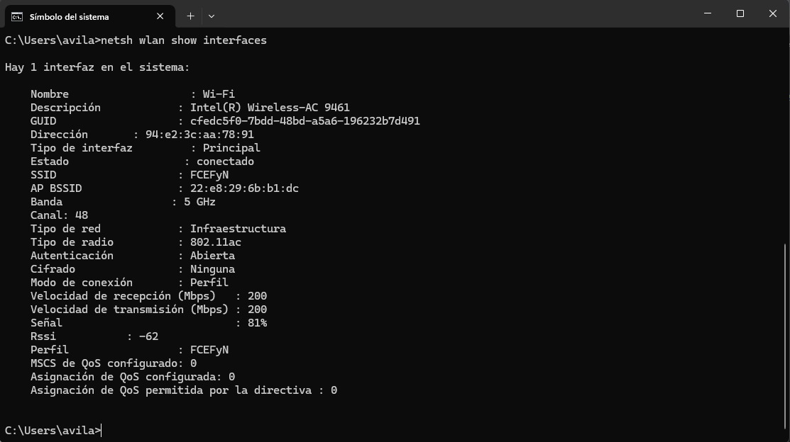

## TRABAJO PRÁCTICO N° 3 ~ Capas de Acceso en Redes Locales, Protocolos y Fundamentos.
## Consigna 1
### A) Investigar los estándares IEEE 802.3 y 802.11, resumir brevemente su historia y campo de aplicación.

***IEEE 802.3 (Ethernet)***

Historia:

- Nació en 1983 como estándar de la IEEE para definir las redes Ethernet.

- Se basó en los trabajos de Xerox, Intel y DEC, quienes habían desarrollado la primera versión de Ethernet en los años 70.

- A lo largo del tiempo fue evolucionando para soportar mayores velocidades (10 Mbps → 100 Mbps “Fast Ethernet” → 1 Gbps “Gigabit Ethernet” → 10, 40, 100 Gbps y más en la actualidad).

- También incorporó mejoras como la transmisión en cobre, fibra óptica y recientemente sobre par trenzado de alta velocidad.

Campo de aplicación:

- Define el funcionamiento de las redes LAN (Local Area Network) por cable.

- Se centra en la capa física (cómo se transmite la señal en el medio) y la subcapa MAC de la capa de enlace de datos (formato de tramas, direccionamiento MAC, control de acceso al medio).

- Es el estándar más utilizado en redes de área local empresariales y hogareñas.

***IEEE 802.11 (Wi-Fi)***

Historia:

- Publicado en 1997 como estándar de redes inalámbricas locales (WLAN).

- La primera versión soportaba velocidades muy bajas (1–2 Mbps en 2.4 GHz).

- Con el tiempo surgieron mejoras: 802.11b (11 Mbps), 802.11a/g (54 Mbps), 802.11n (600 Mbps), 802.11ac (Gbps en 5 GHz) y 802.11ax (Wi-Fi 6) que permite hasta varios Gbps en entornos densos.

- Hoy en día sigue evolucionando, con Wi-Fi 7 (802.11be) ya en desarrollo.

Campo de aplicación:

- Define las redes inalámbricas locales (WLAN), que permiten la conexión sin cables entre dispositivos.

- Opera principalmente en las bandas de 2.4 GHz y 5 GHz, y más recientemente en 6 GHz.

- Se usa en hogares, empresas, universidades, espacios públicos y prácticamente cualquier entorno donde se requiera movilidad.

### B) En la Facultad, conectarse a alguna de las siguientes redes abiertas: FCEFyN, UNC-LIBRE, EduRoam. Determinar qué versión del protocolo 802.11 utiliza y mostrar el procedimiento que utilizó para averiguarlo.

### C) ¿Qué sucede si una red Wi-Fi opera con determinado protocolo y un dispositivo (por ejemplo, una notebook vieja) utiliza una NIC que no soporta dicho protocolo?
Si una red Wi-Fi opera con un determinado protocolo y un dispositivo posee una (NIC) que no lo soporta, pueden darse dos situaciones:

- Si el punto de acceso es retrocompatible, el dispositivo se conectará utilizando la versión más baja que ambos soporten, aunque con menor velocidad y prestaciones.

- Si el punto de acceso no es retrocompatible, el dispositivo directamente no podrá conectarse a la red.
### D) 
### a)¿Qué relación existe entre la versión del protocolo utilizado y la seguridad de la red? 

La versión del protocolo 802.11 utilizada en una red influye también en el tipo de seguridad disponible. A lo largo de la evolución de este estándar, se incorporaron distintos mecanismos de autenticación y cifrado:

- 802.11 original: seguridad nula o muy básica (WEP, fácilmente vulnerable).

- 802.11i (incluido en 802.11g/n/ac): introdujo WPA y WPA2, con cifrado más fuerte (TKIP y AES).

- 802.11ax (Wi-Fi 6): incluye soporte para WPA3, con mejoras en la robustez frente a ataques de diccionario y mayor seguridad en redes abiertas.

### b) Nuevamente conectado a alguna de las redes del punto  determinar qué sistema de seguridad utiliza y qué diferencias tiene con el sistema de seguridad de la versión del protocolo que lo precede.

El tipo de radio de la red FCEyN es 802.11ac pero se puede observar que en los campos de seguridad aparece:
- Autenticación: Abierta
- Cifrado: Ninguna

Se observa que aunque  soporta estándares de seguridad avanzados como WPA2, la red está configurada como red abierta, sin protección en la transmisión de datos.

### E) Considerando los protocolos más recientes y su denominación en el argot de la industria (WiFi 5/6/7), investigar y completar el siguiente cuadro:
| Característica           | **Wi-Fi 5**   | **Wi-Fi 6**                                | **Wi-Fi 7**                              |
| ------------------------ | ------------- | ------------------------------------------ | ---------------------------------------- |
| **Versión IEEE**         | 802.11ac      | 802.11ax                                   | 802.11be                                 |
| **Tasa de datos máxima** | ~3,5 Gbps     | ~9,6 Gbps                                  | >30 Gbps                                 |
| **Banda(s)**             | 5 GHz         | 2,4 GHz y 5 GHz (luego 6 GHz con Wi-Fi 6E) | 2,4 GHz, 5 GHz y 6 GHz                   |
| **Ancho de banda**       | Hasta 160 MHz | Hasta 160 MHz                              | Hasta 320 MHz                            |
| **Modulación**           | 256-QAM       | 1024-QAM                                   | 4096-QAM                                 |
| **Sistema de Seguridad** | WPA2          | WPA3                                       | WPA3 (con mejoras futuras en desarrollo) |

## Consigna 2

### A) Fibra Óptica Monomodo (SMF) y Multimodo (MMF)

Las dos transmisiones que se están ilustrando son de fibra óptica.  
En el primer caso, se trata de **fibra óptica monomodo (SMF)** y **fibra óptica multimodo (MMF)**.  

- **Fibra óptica monomodo (SMF):**  
  - Núcleo de vidrio muy pequeño (≈ 9 micrones).  
  - Utiliza tecnología láser costosa para enviar un solo rayo de luz.  
  - Usada en aplicaciones de **larga distancia** (cientos de km), como telefonía de larga distancia y TV por cable.  

- **Fibra óptica multimodo (MMF):**  
  - Núcleo más grande (50–62,5 micrones).  
  - Utiliza emisores LED para enviar pulsos de luz en diferentes ángulos.  
  - Muy usada en **redes LAN**, por su bajo costo.  
  - Ancho de banda de hasta **10 Gbps** en enlaces de hasta **550 metros**.  

**Diferencias clave:**  
- La **dispersión** (ensanchamiento de los pulsos de luz en el tiempo) es mucho mayor en multimodo que en monomodo.  
- Multimodo solo puede alcanzar hasta **500 metros** antes de que la señal se degrade.  
- Monomodo es más costosa de implementar (láser + núcleo más pequeño), mientras que multimodo es más económica (LEDs y núcleo más ancho).  

---

### B) Relación de la Ley de Snell con la Fibra Óptica

La **ley de Snell** describe cómo la luz cambia de dirección al pasar de un medio a otro con diferente índice de refracción:  

n1 * sin(θ1) = n2 * sin(θ2)

En la fibra óptica:  
- El **núcleo** tiene un índice de refracción n1  
- El **revestimiento** tiene un índice n2, con n1 > n2

Cuando la luz entra en la fibra:  
- Se refracta en la interfaz aire–núcleo según la ley de Snell.  
- Se calcula el **ángulo crítico** que permite la **reflexión interna total**:  

sin(θc) = n2 / n1

Gracias a esto, la señal óptica se transmite a lo largo de grandes distancias sin escapar del núcleo.  

---

### C) Relación entre Conexiones Inalámbricas y Fibra Óptica

1. **Ambas usan ondas electromagnéticas**  
   - Fibra óptica: transmite luz (espectro óptico).  
   - Conexiones inalámbricas: transmiten radiofrecuencia (espectro de radio/microondas).  
   - Diferencia: usan distintas bandas del espectro.  

2. **Necesitan un medio de propagación**  
   - Fibra óptica: la luz viaja confinada en el núcleo por reflexión interna total.  
   - Inalámbricas: la señal viaja en el aire y sufre atenuación, interferencias y dispersión.  

3. **Estándares actuales**  
   - Hoy en día, ambos se utilizan en conjunto.  
   - Los **routers domésticos** combinan fibra óptica (reemplazando al cobre) con conexiones inalámbricas a Internet.  

## Consigna 3
### A) Completar el siguiente cuadro, que lista algunos de los protocolos inalámbricos más comunes:
| Protocolo | ¿Está estandarizado? | Estándar / Última versión relevante |
|-----------|----------------------|-------------------------------------|
| **Wi-Fi** | ✅ Sí | IEEE 802.11 (última versión: 802.11ax, conocido como Wi‑Fi 6; en desarrollo Wi‑Fi 7 = 802.11be) |
| **Bluetooth** | ✅ Sí | IEEE 802.15.1 (inicialmente), ahora gestionado por Bluetooth SIG. Última versión: 5.3 / 5.4 |
| **ZigBee** | ✅ Sí | Basado en IEEE 802.15.4 (capa física y MAC). Última versión: ZigBee PRO 2017 |
| **NFC** | ✅ Sí | ISO/IEC 18092, ISO/IEC 14443, ECMA‑340. Última versión: ISO/IEC 18092:2013 |
| **LTE** | ✅ Sí | 3GPP TS 36.xxx. LTE estándar desde Release 8; LTE‑Advanced (Rel. 10+), LTE‑Advanced Pro (Rel. 13) |
| **GSM** | ✅ Sí | 3GPP TS 45.x / ETSI. Estándar original de 2G (1992) y posteriores |
| **3G (UMTS)** | ✅ Sí | 3GPP TS 25.xxx. Estándar IMT‑2000, Releases 99 en adelante |
| **LoRa** | ⚠️ Parcial | LoRa (capa física) es propietario de Semtech. LoRaWAN (capa MAC/red) estandarizado por LoRa Alliance. Última versión: LoRaWAN 1.0.4 |
| **NB‑IoT** | ✅ Sí | 3GPP Release 13 (LTE Cat‑NB1), mejorado en Release 14 (Cat‑NB2) |
| **SigFox** | ❌ No | Tecnología cerrada, controlada por la empresa Sigfox. No es estándar abierto |
| **Z‑Wave** | ✅ Sí (desde 2020) | Originalmente propietario, ahora estandarizado por ITU‑T G.9959. Última versión: Z‑Wave Plus v2 (2019) |

### B) Sobre los protocolos mencionados, investigar y colocarlos en el siguiente gráfico (de manera aproximada) de acuerdo a sus características de alcance (distancia) y data rate.

| Protocolo   | Distancia típica (aprox.) | Data rate típico (aprox.) |
|-------------|----------------------------|----------------------------|
| **NFC**     | < 0.1 m                   | 106 – 424 kbps             |
| **Bluetooth** | 1 – 100 m                | 125 kbps – 2 Mbps          |
| **ZigBee**  | 10 – 100 m                 | 20 – 250 kbps              |
| **Z-Wave**  | 30 – 100 m                 | 9.6 – 100 kbps             |
| **Wi-Fi**   | 10 – 100 m                 | 10 Mbps – 1 Gbps           |
| **NB-IoT**  | 1 – 10 km                  | 20 – 250 kbps              |
| **GSM (2G)**| 1 – 35 km                  | 9.6 – 200 kbps             |
| **LTE (4G)**| 1 – 10 km                  | 10 Mbps – 1 Gbps           |
| **5G**      | 100 m – 10 km              | 100 Mbps – 10 Gbps         |
| **LoRa**    | 2 – 15 km                  | 0.3 – 50 kbps              |
| **SigFox**  | 3 – 10 km (hasta 40 km rural) | 100 – 600 bps            |

### C) De acuerdo a lo investigado y visto en las clases teóricas, completar el siguiente cuadro con las características indicadas para los distintos medios de transmisión:
| Característica                          | UTP (Par trenzado sin blindaje) | Fibra Óptica | Wi-Fi 802.11be (Wi‑Fi 7) | Bluetooth 5.4 | 5G |
|----------------------------------------|---------------------------------|--------------|--------------------------|---------------|----|
| **Ancho de banda**                     | Hasta 1–10 Gbps (Cat 5e/6/6a/7/8) | >100 Gbps (dependiendo del tipo: monomodo/multimodo) | Hasta ~40 Gbps teóricos | Hasta 2 Mbps (BLE), hasta 24 Mbps clásico | Hasta 10 Gbps (dependiendo de banda y despliegue) |
| **Distancias**                         | 100 m máx. (Ethernet estándar) | >40 km (monomodo), hasta 2 km (multimodo) | 30–100 m típicos | 1–100 m (según potencia y versión) | 1–10 km en celdas urbanas, hasta decenas de km en rurales |
| **Inmunidad a EMI / RFI**              | Baja (susceptible a interferencias) | Muy alta (inmune a EMI/RFI) | Media (afectado por obstáculos y saturación de espectro) | Media-baja (interferencias en 2.4 GHz) | Media (mejor que Wi-Fi, pero depende de la banda) |
| **Costos de medios/conectores/dispositivos** | Bajo (cables y conectores económicos) | Alto (cables, conectores y equipos más costosos) | Medio (routers/AP de gama media-alta) | Muy bajo (chips y módulos baratos) | Alto (infraestructura y dispositivos avanzados) |
| **¿Disponible en Packet Tracer?**      | ✅ Sí | ❌ No | ✅ Sí (versiones previas de Wi-Fi, no 802.11be aún) | ❌ No | ❌ No |

----
## Consgigna 4. Estado del arte: Internet en aviones

El estado del arte es la sección de un trabajo académico donde se presenta un relevamiento actualizado de lo que ya se ha investigado, desarrollado y publicado sobre un tema en particular. Funciona como un mapa del conocimiento existente, resumiendo tecnologías, avances y limitaciones.

---

### A) Tecnologías que permiten conectarse a Internet en un avión

| Tecnología                           | Cómo funciona / arquitectura básica                                                                                                                                     | Ventajas principales                                                                                                                                                     | Limitaciones                                                                                                                                                                                                                                                                                                                                                                  |
|--------------------------------------|-------------------------------------------------------------------------------------------------------------------------------------------------------------------------|--------------------------------------------------------------------------------------------------------------------------------------------------------------------------|-------------------------------------------------------------------------------------------------------------------------------------------------------------------------------------------------------------------------------------------------------------------------------------------------------------------------------------------------------------------------------|
| **Satcom con satélites geoestacionarios (GEO)** | Utiliza satélites en órbita geoestacionaria (~35,786 km) que cubren grandes regiones terrestres; el avión envía señal al satélite, éste la reenvía a estación de tierra y luego se entra a Internet. | Cobertura muy amplia; relativamente probado; menos handovers/inconvenientes si no se mueve mucho en latitud/longitud.                                                    | Alta latencia (por la distancia hasta GEO), pérdidas por clima/plumas, coste elevado del enlace, limitaciones de ancho de banda por satélite compartido.                                                                                                                                                                                                                       |
| **Satcom con satélites de órbita baja (LEO)**   | Conjuntos de satélites más cercanos a la Tierra (varios cientos a pocos miles de km), moviéndose rápidamente, con haces que apuntan a estaciones de seguimiento, etc.   | Menor latencia que GEO; cobertura más global si la constelación es buena; posibilidad de mucha capacidad si hay muchos satélites; mejores potencialidades para streaming o servicios en tiempo real. | Requiere handovers entre satélites, control de enlace (tracking), más estaciones terrestres de soporte; riesgo de interferencias; costes de infraestructura alta; limitaciones de visibilidad (obstrucciones, condiciones atmosféricas).                                                                                                                                      |
| **Air-to-Ground (A2G o ATG)**        | El avión se conecta directamente a torres terrestres de comunicación (como estaciones de celular modificadas) mediante antenas orientadas hacia abajo, con tecnología LTE/5G u otras adaptadas. El tráfico luego entra al backbone terrestre. | Latencia baja, buen ancho de banda en rutas sobre tierra bien servidas; coste de operación relativamente menor que sólo satélite; buenos para vuelos domésticos, cortos o medianos; menor retardo. | Sólo sirve cuando el avión está sobre tierra donde hay cobertura; no útil sobre océanos, zonas polares, desiertos remotos. Limitaciones de celado de antenas, cambio de células rápido por velocidad del avión, problemas de señal cuando atraviesa muchos territorios. También el espectro y licencias pueden ser un problema.                                                      |
| **Híbridos / mixtos**                | Combinan más de una tecnología: por ejemplo A2G cuando está disponible, satélite cuando no lo está; o GEO + LEO; también uso de almacenamiento local, caching, etc.      | Permiten optimizar el coste y la experiencia: mantener baja latencia donde es posible, y cobertura continua. Más resilientes.                                            | Mayor complejidad: decisión de cambio (handover), gestión de tráfico diferencial, orquestación de rutas/satélites/enlaces, sincronización, interoperabilidad, coste de múltiples equipos.                                                                                                                                                                                                                              |

**Parámetros técnicos clave a considerar:**  
- Latencia (delay) y jitters  
- Ancho de banda disponible / throughput agregado  
- Ratio subida / bajada (upload vs download)  
- Pérdida de paquetes (packet loss), estabilidad  
- Handovers (entre satélites o entre torres A2G) — transición suave  
- Riesgo de interferencia, condiciones climáticas (lluvia, nubes densas afectan frecuencias altas como Ka, Ka-band)  
- Peso, consumo, espacio de la antena en el avión  
- Regulación y licencias espectrales  
- Costos operativos y de mantenimiento  
- Seguridad: cifrado, aislamiento del sistema de IFC frente a los sistemas críticos del avión  

---

### B) Publicación reciente (no mayor a un año)

Son dos trabajos, uno más aplicado, otro más de investigación:  

**“Enabling Continuous 5G Connectivity in Aircraft through Low Earth Orbit Satellites”**  

Autores: Raúl Parada, Víctor Monzón Baeza, Carlos Horcajo Fernández de Gamboa, Rocío Serrano Camacho, Carlos Monzó  
Fecha: abril de 2025  

El trabajo busca resolver el problema de la conectividad continua y de alta velocidad en aviones usando satélites de órbita baja (LEO) en vez de los geoestacionarios (GEO), que tienen más latencia y limitaciones de cobertura.  

**Conclusiones del paper**  
- Es viable usar satélites LEO para ofrecer conectividad 5G continua en vuelos comerciales.  
- Los handovers dinámicos y adaptativos son críticos para minimizar pérdidas de señal.  
- La cobertura interna puede optimizarse con antenas distribuidas y técnicas MIMO/beamforming.  
- Futuras investigaciones deben explorar constelaciones más grandes y combinaciones de satélites y estaciones terrestres para lograr cobertura global sin interrupciones.  

**Resumiendo**  
Este paper propone y valida un modelo para que los aviones tengan Internet 5G ininterrumpido usando satélites LEO, mostrando que con la infraestructura adecuada es posible alcanzar casi cobertura total y buena calidad de señal durante todo el vuelo.  

🔗 [arXiv:2504.07262](https://arxiv.org/abs/2504.07262)  

---

**“Satellite Connectivity Prediction for Fast-Moving Platforms”**  

Autores: Chao Yan, Babak Mafakheri  
Fecha: julio de 2025  

En este paper se hace uso de técnicas de aprendizaje automático para predecir calidad de conectividad satelital para plataformas móviles rápidas (aviones, trenes, vehículos). Permite anticipar cambios de calidad (por ejemplo cuando un satélite deja de tener óptima visibilidad) y hacer switching proactivo entre satélites o haces para optimizar la experiencia del usuario.  

Estas publicaciones pueden servir como punto de partida para ver lo que se está investigando ahora (LEO, handover, predictions, optimización, etc.).  

🔗 [arXiv:2508.00877](https://arxiv.org/abs/2508.00877)  

---

### C) División del tráfico entre contenido a bordo (IFE) e Internet, comparativas, cómo se podría simular

Algunas ideas y consideraciones:  

- **Contenido a bordo (IFE – In-Flight Entertainment):** normalmente alojado en servidores locales instalados en el avión, ya sea en fuselaje o en bodega; el contenido (películas, música, juegos, mapas, etc.) se entrega al pasajero mediante una red Wi-Fi interna (in-cabin Wi-Fi), no con acceso saliente a Internet. Este tráfico no consume el enlace satelital ni A2G hacia tierra; es local, lo que permite ofrecerlo gratis o como parte del servicio sin coste de enlace externo.  

- **Tráfico hacia Internet (IFC – In-Flight Connectivity):** correo electrónico, navegación web, streaming si está permitido, etc. Este tráfico atraviesa por los enlaces satélite / A2G / híbrido, y en general es el que se cobra o se limita, ya que implica coste con la infraestructura de conexión hacia tierra, licencias, satélites, etc.  

La división del tráfico es:  
A. El sistema de gestión de red a bordo debe distinguir entre tráfico hacia Internet vs tráfico local, de modo de priorizar, limitar, asignar QoS distinto, etc.  
B. Posible uso de políticas: por ejemplo, dar prioridad a tráfico ligero (correo, mensajería) en los enlaces satelitales, y tal vez limitar el ancho para streaming si muchos usuarios lo usan al mismo tiempo.  

---

#### C. Comparativa

| Aspecto                | Ver película (IFE)                                                                                     | Enviar/recibir correo (IFC)                                                               |
|-------------------------|-------------------------------------------------------------------------------------------------------|-------------------------------------------------------------------------------------------|
| **Uso de banda**        | Alto si es HD/4K, streaming o descarga; pero no consume enlaces externos al ser contenido local.       | Mucho menor; generalmente pocos KBs (texto e imágenes).                                   |
| **Latencia perceptible**| Muy baja, depende solo de la red Wi-Fi interna.                                                        | Puede ser mayor, depende del enlace satélite/A2G (GEO: alto retardo, LEO/A2G: menor).     |
| **Fiabilidad/calidad**  | Alta si la infraestructura interna está bien dimensionada; no depende de condiciones externas.         | Depende de calidad del enlace, clima, saturación, interferencias, etc.                    |

---

#### Como se divide el tráfico

- El sistema de gestión de red a bordo debe distinguir entre tráfico hacia Internet vs tráfico local, de modo de priorizar, limitar, asignar QoS distinto, etc.  
- Posible uso de políticas: por ejemplo, dar prioridad a tráfico ligero (correo, mensajería) en los enlaces satelitales, y tal vez limitar el ancho para streaming si muchos usuarios lo usan al mismo tiempo.  

