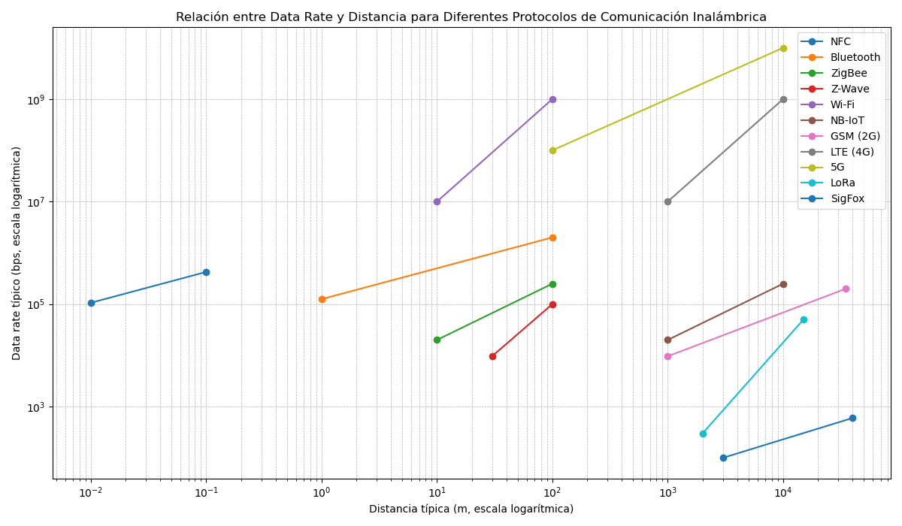

## TRABAJO PRÁCTICO N° 3 ~ Capas de Acceso en Redes Locales, Protocolos y Fundamentos.

Cosigna 3a 
| Protocolo | ¿Está estandarizado? | Estándar / Última versión relevante |
|-----------|----------------------|-------------------------------------|
| **Wi-Fi** | ✅ Sí | IEEE 802.11 (última versión: 802.11ax, conocido como Wi‑Fi 6; en desarrollo Wi‑Fi 7 = 802.11be) |
| **Bluetooth** | ✅ Sí | IEEE 802.15.1 (inicialmente), ahora gestionado por Bluetooth SIG. Última versión: 5.3 / 5.4 |
| **ZigBee** | ✅ Sí | Basado en IEEE 802.15.4 (capa física y MAC). Última versión: ZigBee PRO 2017 |
| **NFC** | ✅ Sí | ISO/IEC 18092, ISO/IEC 14443, ECMA‑340. Última versión: ISO/IEC 18092:2013 |
| **LTE** | ✅ Sí | 3GPP TS 36.xxx. LTE estándar desde Release 8; LTE‑Advanced (Rel. 10+), LTE‑Advanced Pro (Rel. 13) |
| **GSM** | ✅ Sí | 3GPP TS 45.x / ETSI. Estándar original de 2G (1992) y posteriores |
| **3G (UMTS)** | ✅ Sí | 3GPP TS 25.xxx. Estándar IMT‑2000, Releases 99 en adelante |
| **LoRa** | ⚠️ Parcial | LoRa (capa física) es propietario de Semtech. LoRaWAN (capa MAC/red) estandarizado por LoRa Alliance. Última versión: LoRaWAN 1.0.4 |
| **NB‑IoT** | ✅ Sí | 3GPP Release 13 (LTE Cat‑NB1), mejorado en Release 14 (Cat‑NB2) |
| **SigFox** | ❌ No | Tecnología cerrada, controlada por la empresa Sigfox. No es estándar abierto |
| **Z‑Wave** | ✅ Sí (desde 2020) | Originalmente propietario, ahora estandarizado por ITU‑T G.9959. Última versión: Z‑Wave Plus v2 (2019) |

Cosigna 3b  

| Protocolo   | Distancia típica (aprox.) | Data rate típico (aprox.) |
|-------------|----------------------------|----------------------------|
| **NFC**     | < 0.1 m                   | 106 – 424 kbps             |
| **Bluetooth** | 1 – 100 m                | 125 kbps – 2 Mbps          |
| **ZigBee**  | 10 – 100 m                 | 20 – 250 kbps              |
| **Z-Wave**  | 30 – 100 m                 | 9.6 – 100 kbps             |
| **Wi-Fi**   | 10 – 100 m                 | 10 Mbps – 1 Gbps           |
| **NB-IoT**  | 1 – 10 km                  | 20 – 250 kbps              |
| **GSM (2G)**| 1 – 35 km                  | 9.6 – 200 kbps             |
| **LTE (4G)**| 1 – 10 km                  | 10 Mbps – 1 Gbps           |
| **5G**      | 100 m – 10 km              | 100 Mbps – 10 Gbps         |
| **LoRa**    | 2 – 15 km                  | 0.3 – 50 kbps              |
| **SigFox**  | 3 – 10 km (hasta 40 km rural) | 100 – 600 bps            |

Consigna 3c 
| Característica                          | UTP (Par trenzado sin blindaje) | Fibra Óptica | Wi-Fi 802.11be (Wi‑Fi 7) | Bluetooth 5.4 | 5G |
|----------------------------------------|---------------------------------|--------------|--------------------------|---------------|----|
| **Ancho de banda**                     | Hasta 1–10 Gbps (Cat 5e/6/6a/7/8) | >100 Gbps (dependiendo del tipo: monomodo/multimodo) | Hasta ~40 Gbps teóricos | Hasta 2 Mbps (BLE), hasta 24 Mbps clásico | Hasta 10 Gbps (dependiendo de banda y despliegue) |
| **Distancias**                         | 100 m máx. (Ethernet estándar) | >40 km (monomodo), hasta 2 km (multimodo) | 30–100 m típicos | 1–100 m (según potencia y versión) | 1–10 km en celdas urbanas, hasta decenas de km en rurales |
| **Inmunidad a EMI / RFI**              | Baja (susceptible a interferencias) | Muy alta (inmune a EMI/RFI) | Media (afectado por obstáculos y saturación de espectro) | Media-baja (interferencias en 2.4 GHz) | Media (mejor que Wi-Fi, pero depende de la banda) |
| **Costos de medios/conectores/dispositivos** | Bajo (cables y conectores económicos) | Alto (cables, conectores y equipos más costosos) | Medio (routers/AP de gama media-alta) | Muy bajo (chips y módulos baratos) | Alto (infraestructura y dispositivos avanzados) |
| **¿Disponible en Packet Tracer?**      | ✅ Sí | ❌ No | ✅ Sí (versiones previas de Wi-Fi, no 802.11be aún) | ❌ No | ❌ No |
