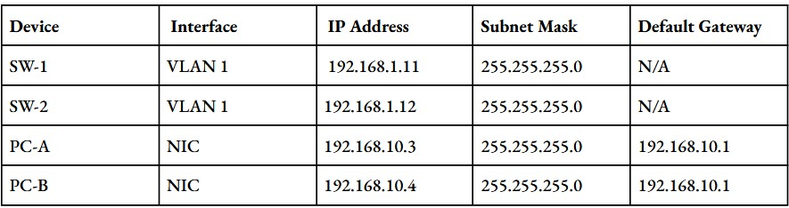
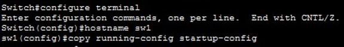
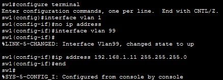

# Trabajo Práctico N°4 ~ Capas de Acceso en Redes Locales, Protocolos y Fundamentos

## Consigna 1
### A) Investigar como se clasifican las redes según su alcance. Mencionar brevemente las características principales de cada una y colocar en cada cuadro de la Figura el acrónimo de red que corresponda.

Clasificación de redes según su alcance
- PAN (Personal Area Network)
    - Alcance: hasta ~1–2 metros, alrededor de una persona.

    - Uso típico: conexión entre dispositivos personales (celular, auriculares BT, smartwatch, mouse, teclado).

    - Tecnologías: Bluetooth, USB, IR, etc.    
- LAN (Local Area Network)

    - Alcance: una habitación, oficina, laboratorio, casa o edificio.

    - Uso típico: conexión de PCs, impresoras, servidores dentro de la misma organización o domicilio.

    - Características: alta velocidad, baja latencia, suele ser de propiedad privada (empresa, hogar).

    - Tecnologías: Ethernet (IEEE 802.3), Wi-Fi (IEEE 802.11) dentro de un mismo ámbito.

- CAN (Campus Area Network) (a veces la engloban como un tipo de LAN grande)

    - Alcance: varios edificios cercanos, por ejemplo un campus universitario o planta industrial.
    - Es básicamente un conjunto de LAN interconectadas dentro de una misma institución en un área geográfica limitada.

- MAN (Metropolitan Area Network)

    - Alcance: una ciudad o área metropolitana.

    - Une muchas LAN (y/o CAN) dentro de una misma región urbana.

    - Suelen ser operadas por proveedores o grandes organizaciones (municipios, universidades grandes, etc.).

- WAN (Wide Area Network)

    - Alcance: países, continentes, o global (ej: Internet).

    - Une redes LAN/MAN a gran distancia usando enlaces de operadores (fibra, microondas, satélite, etc.).

    - Latencias más altas, gestión más compleja, tramos públicos o de proveedores.
### B)¿Qué es una VLAN? ¿Cómo se clasifican?
Una VLAN (Virtual Local Area Network) es una red lógica creada dentro de una red física, que permite separar dispositivos en distintos dominios de broadcast sin necesidad de usar switches físicos separados.

Características principales

- Segmentación lógica: divide una red LAN grande en redes más pequeñas y aisladas.

- Aíslan tráfico: el broadcast de una VLAN no puede pasar a otra VLAN.

- Mejoran seguridad: equipos de áreas distintas no pueden comunicarse directamente si están en VLAN diferentes.

- Usan etiquetas 802.1Q: los switches “marcan” cada frame para saber a qué VLAN pertenece.

- Más flexibilidad: se puede agrupar equipos por función, aunque estén en lugares distintos del edificio.
### C) Investigar y resumir el protocolo IEEE 802.1Q. ¿Cómo se relaciona con las VLAN?
El IEEE 802.1Q es el estándar que define cómo se identifican y transportan múltiples VLAN dentro de una misma red Ethernet. Su función principal es permitir que un enlace físico pueda llevar tráfico de varias VLAN simultáneamente mediante el uso de una etiqueta (tag) que indica a qué VLAN pertenece cada trama, manteniendo todas las VLAN separadas de manera lógica.
### D) En el contexto de los dos ítems anteriores ¿Qué es el Tagging?
El tagging es el proceso mediante el cual un switch agrega una etiqueta (tag) 802.1Q a una trama Ethernet para indicar a qué VLAN pertenece.
Este tag se inserta en la trama cuando debe viajar por un enlace configurado como trunk, donde circula tráfico de múltiples VLAN al mismo tiempo.

## Consigna 2

Se implementa la siguiente topología en Packet Tracer, conectando los PCs a los switches mediante cables de consola para la configuración inicial y cables de cobre directos para la conexión de red (ej. PC-A a F0/6, PC-B a F0/18, y SW-1 F0/1 a SW-2 F0/1).

Con la siguiente tabla de enrutamiento

### a) Configuramos el nombre de cada switch. sw1 y sw2 para cada switch respectivamente

### b) Ahora, asignamos contraseñas privilegiadas para cada switch
Contraseña consola = wan_piece_console
Contraseña modo privilegiado = wan_piece_secret
Contraseña lineas vty 0 a 15 = wan_piece_vty

Ademas, en la misma imagen, y para cada switch, se habilita el servicio password-encryption para encriptar las contraseñas que estaban en texto plano.

### d) Ahora se configuran las redes VLAN 1 para cada switch, segun las ip y mascaras de subred proporcionadas:

### e) Ahora, se desconectan todas las interfaces que no estan siendo utilizadas. 
Para el caso del switch 1, los puertos que deben apagarse con shutdown son: F0/2 al F0/5, F0/7 al F0/24, y los puertos Gigabit G0/1 al G0/2.
Para switch 2, estos puertos son: F0/2 al F0/17, F0/19 al F0/24, y los puertos Gigabit G0/1 al G0/2.

En el caso de switch 2:

Para guardar las configuraciones de la RAM a la NVRAM, y que queden luego de apagado cada switch, se tiene que introducir el siguiente comando:
sw1# copy running-config startup-config 

### g) Ahora, se testea la conexion entre ambas PCs. Para eso, se utiliza el comando ping seguido de la direccion ip de la otra PC.

**ping pcA -> pcB:**

**ping pcB -> pcA:**

### h) Ahora, se crean VLANs en ambos switches sw1 y sw2

Lo mismo para sw2.

### i)Verificación de VLANs

Ahora, con el comando show vlan brief, podemos visualizar que la vlan utilizada por defecto es la VLAN 1, ya que dice "default"

### j) Se asigna PC-A a VLAN 10 (en SW-1)

### k) Mover IP de Management a VLAN 99 (en SW-1)

### l) Verificación de Estado (en SW-1)

Se verifica la nueva asignación de puertos y el estado de las interfaces.

**Salida de `show vlan brief`:**

Se puede observar el puerto F0/6 ahora está asignado a la VLAN 10 (Laboratorio). Todos los demás puertos (excepto F0/1) seguirán en la VLAN 1.
Esto significa que PC-A está ahora lógicamente separado del resto de los puertos del switch.

**Salida de `show ip interface brief`:**

Se puede apreciar que ahora vlan1 aparece como "unassigned", no tiene ip, mientras que ahora vlan99 aparece en estado up y con su ip correspondiente asignada. 
Lo que se ve con esto es que ahora la gestión del switch (su IP) ya no está en la VLAN 1, sino en la VLAN 99

### m) Verificacion de la conectividad

Ahora se procede a asignar la PC-B a la VLAN Laboratorio en el sw2. 

### n) Verificacion de la conectividad entre PC-A y PC-B utilizando pings.

Procedemos a utilizar pings entre pcA a pcB y viceversa. 

**ping pcA -> pcB (fallido):**

**ping pcA -> pcB (fallido):**

Podemos apreciar que ambos ping fallan. Por lo que pudimos investigar, si bien los PCs (en los extremos) están en la VLAN 10, el enlace que conecta los dos switches (en el medio) sigue estando en la VLAN 1. El tráfico de la VLAN 10 (de PC-A) llega al SW-1, pero el SW-1 no puede enviarlo por el puerto F0/1, ya que ese puerto solo tiene permiso para transportar tráfico de la VLAN 1. El paquete se descarta y nunca llega al SW-2. 

Ahora se intenta hacer un ping desde sw1 hacia sw2

**ping sw1 -> sw2 (fallido):**

Esto vuelve a fallar, ya que las ip de ambos switches 192.168.1.11 y 192.168.1.11 se encuentran en la VLAN 99, mientras que el enlace F0/1 entre ellos sigue estando en la VLAN 1.
Al parecer, el tráfico de la VLAN 99 tampoco puede cruzar ese enlace
