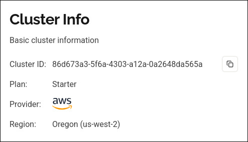
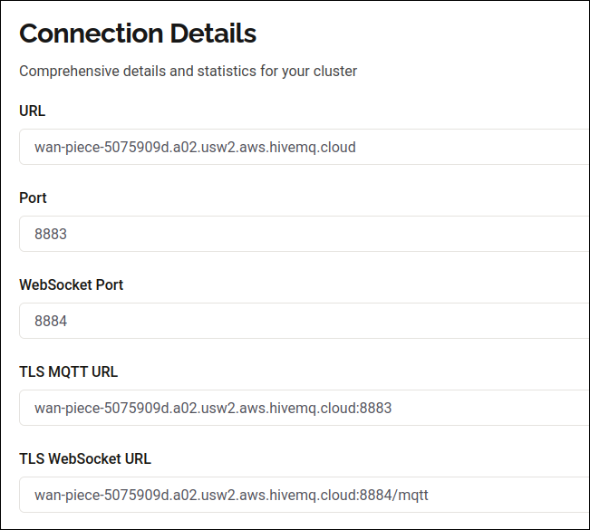
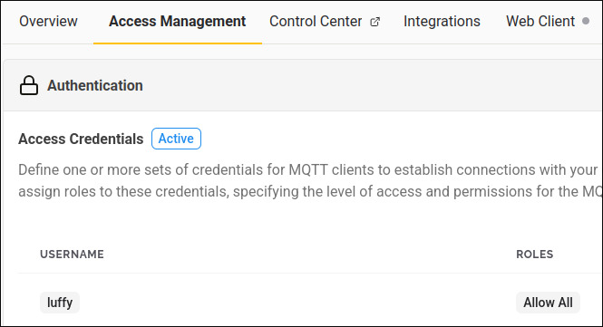
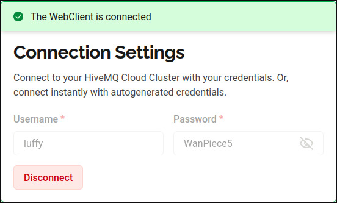
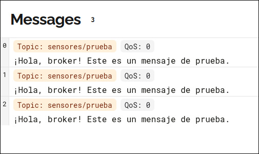

# Trabajo Práctico N°5  ~ Simulación de una Red Local utilizando MQTT

## Consigna 1

### Resumir brevemente las características del protocolo MQTT. Incluir ventajas, desventajas y principales usos. Responder: ¿Qué es el patrón de diseño PubSub?

Para hablar del protocolo MQTT, primero hay que definir el **patrón** de diseño PubSUb.

### **Patrón** de diseño PubSub

El **patrón** PubSub es un modelo de **comunicación**, donde los que **envían** mensajes (publishers) no se comunican directamente con los que los reciben (suscribers), sino que se hace a **través** de un intermediario central llamado Broker. Los publishers publican mensajes en **Tópicos** (**categorías**), y el broker **reenvía** esos mensajes a todos los Suscribers que se hayan suscrito a esos **tópicos**.

La principal ventaja que provee este **patrón** de diseño es el desacoplamiento de los componentes. Los publishers y suscribers no se conocen. No necesitan saber su **dirección** IP. Estos pueden estar en redes diferentes. **Además**, no necesitan estar conectados al mismo tiempo (el Broker puede guardar el mensaje si el suscriptor **está** offline, dependiendo de la **configuración**);

### ¿Qué es MQTT?

MQTT (Message Queuing **Telemetry** Transport) es un protocolo de **mensajería** (un conjunto de reglas) que usa el **patrón** Pub/Sub. Su **característica** principal es que es extremadamente ligero y eficiente. Fue **diseñado** para usar la menor **cantidad** de datos (ancho de banda) posible.

### Ventajas:

- Es muy liviano (perfecto para redes lentas o inestables, como redes **móviles** o **satelitales**)

- Bajo consumo de **batería** (ideal para dispositivos IoT)

- Maneja niveles de calidad de servicio (QoS) para asegurar que un mensaje llegue (al menos una vez, como **máximo** una vez, o exactamente una vez)

- Es desacoplado y escalable (**fácil** añadir **más** sensores o apps)

### Desventajas:

- Depende 100% del Broker. Si el Broker se cae, todo el sistema de **comunicación** se detiene (es un "**punto** **único** de fallo").

- **Está** pensado para mensajes cortos y datos pequeños (**telemetría**), no para enviar archivos grandes o hacer streaming de video.

### Usos principales

- Internet of Things (IoT): Es el **estándar** de la industria. Sensores en el campo, luces inteligentes para el hogar, medidores de agua, GPS de **vehículos**, etc.

- Notificaciones push: Muchas apps **móviles** lo usan para enviar notificaciones.

- Apps de chat: Facebook Messenger lo **usó** durante mucho tiempo.

## Consigna 2

### Instalar/desplegar y ejecutar un broker MQTT.

Para eso, tenemos que ir a la pagina web https://console.hivemq.cloud/. Nos registramos, solicitamos el pack starter, el cual es gratuito, y abrimos nuestro primer Cluster:

Se puede apreciar la URL del host del broker y el puerto de conexión (TLS) asignado.

Con los siguientes parametros de red (colocados por defecto):

Finalmente, para la autenticación, se crea el usuario 'luffy', con su respectiva contraseña dentro de la gestión de acceso del cluster:

## Consigna 3

### Verificar que el broker funciona, suscribiendote con un cliente

Para llevar a cabo este paso, tenemos que dirigirnos hacia la Web Client, dentro de HiveMQ Cloud.

Luego, se procede a conectarse al cluster en la nube con las credenciales que generamos anteriormente. username: luffy, password: WanPiece5

Ahora, se realiza la simulacion, tanto del suscriber como el publisher. Dentro de HiveQM Cloud, se tiene integrado un cliente Web, el cual utilizaremos para suscribirnos. Por el otro lado, tenemos una simulacion en Python de un publisher, el cual envia los datos hacia el Broker. El cliente web, al estar escuchando el mismo topico que el publisher, debe recibir los datos enviados desde el publisher de Python.
El codigo de Python se adjunta en el directorio "tp5_mqtt" con el nombre de "prueba.py"

En el publisher, se configura la conexion hacia el Broker, con los datos de conexion, como la URL del broker, el puerto 8883, las credenciales para el acceso. Luego, se configuran los datos para la recepcion, como el topico, el cual se debe especificar para que los clientes se suscriban a ese tema en especifico. En este caso, se eligio "sensores/prueba" como topico. Por ultimo, el mensaje a enviar por parte del publisher es "Hola, broker! Este es un mensaje de prueba."

**Recepcion del cliente web en el Broker**

