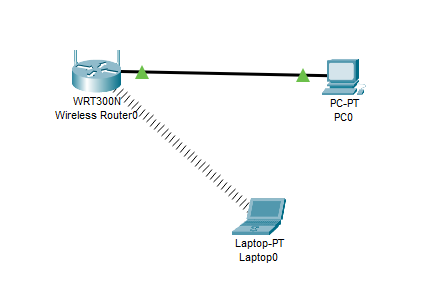
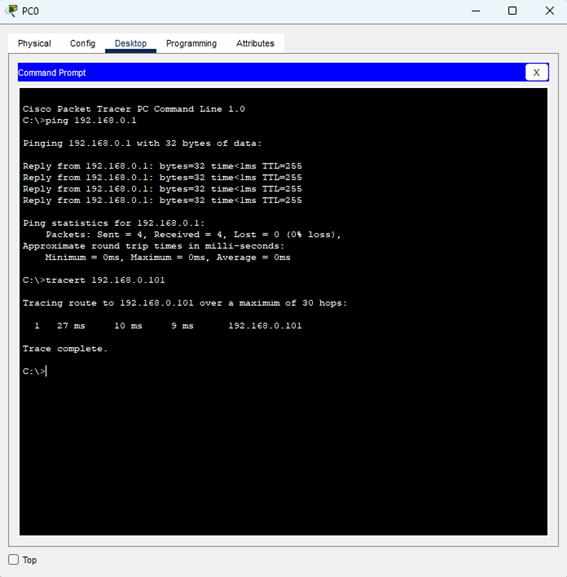
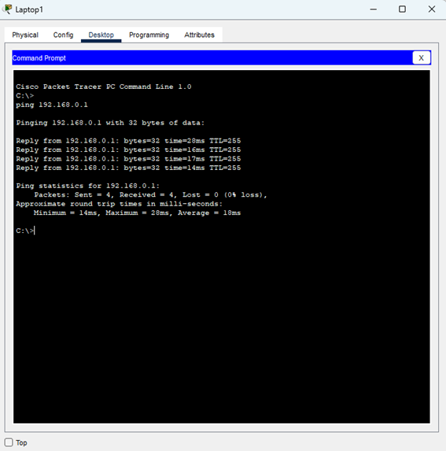
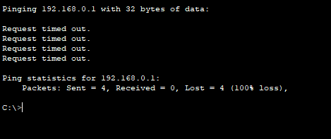

Laboratorio N1 \- Comunicaciones de Datos 2025 

# Resumen 

	

## Ondas Electromagnéticas 

	Las ondas son perturbaciones en un medio o en un campo produciendo oscilaciones.  
Las ondas electromagnéticas son la combinación de campos eléctricos y 	magnéticos oscilantes, generados por cargas en movimiento (aceleradas). Al acelerarse, oscila en su campo eléctrico, lo que produce un campo magnético. 

Las radiaciones de alta frecuencia y corta longitud de onda son ionizantes, ya que tienen suficiente energía para arrancar electrones de los átomos y pueden ser peligrosas. En cambio, las radiaciones de baja frecuencia y  onda larga no son ionizantes.

### 	Características 

* No requieren de un medio material para propagarse  
* Son ondas transversales: el campo eléctrico, el campo magnético y la dirección de propagación son mutuamente perpendiculares  
* Son periódicas en el tiempo y el espacio:   
* En el vacío su velocidad de propagación es la misma que la de la luz, de aproximadamente 3x108 m/s   
* La longitud de onda 𝛌 es la distancia entre dos picos adyacentes entre las ondas   
* La frecuencia (f) es el número de oscilaciones por segundo 

## Modulación y Demodulación

## 

La modulación es el proceso mediante el cual una señal de información (generalmente de baja frecuencia) se “monta” sobre una señal portadora de mayor frecuencia para ser transmitida eficientemente a largas distancias.  
Existen diferentes tipos:

* AM (Amplitud Modulada): la amplitud de la portadora varía con la señal.

* FM (Frecuencia Modulada): la frecuencia de la portadora cambia con la señal.

* PM (Modulación de Fase): la fase de la portadora se modifica.

La demodulación es el proceso inverso: recuperar la señal de información original a partir de la señal modulada recibida.

## Señales de Tiempo Continuo

Son aquellas definidas para todo instante de tiempo.

* Su dominio es continuo (t∈Rt \\in \\mathbb{R}t∈R).  
* Se representan como x(t)x(t)x(t).  
* Se usan en sistemas analógicos.

## Señales de Tiempo Discreto

Son aquellas definidas sólo en instantes específicos, obtenidas usualmente mediante un muestreo de una señal continua.

* Su dominio es discreto (𝑛 ∈ 𝑍)  
* Se representan como 𝑥\[𝑛\]  
* Son la base del procesamiento digital de señales.

# 

# Análisis del Gráfico 

1. Analizando el gráfico de la consigna: 

		  
		Podemos observar que la onda es una onda electromagnética senoidal, la cual se va atenuando a medida que va aumentando la distancia (representada en el eje X) y su longitud de onda (𝛌) es de 60mm ≈ 0,06 m.   
	

2. Considerando que viaja a la velocidad de la luz C ≈ 3x108 m/s su frecuencia y longitud de onda son:   
    \= 0,06 m   
   	f \= c    → f \= 3x108 m/s0,06m  \=5x109 Hz    
   3. Según la ITU, como tiene una frecuencia de 5GHz corresponde a la banda UIT: SHF- Super High Frequency, que va de los 3 a los 30 GHz y dentro de las bandas de microondas se ubica en la banda C que va de los 4 a los 8 GHz   
   4. Los dispositivos para comunicaciones de datos que operan en esta banda son: redes Wi-Fi, algunos sistemas de radar, comunicaciones de enlace punto a punto. Ejemplo: Wi-Fi de 5GHz en routers domésticos  
   5. La línea roja punteada es la atenuación de la señal con respecto a la distancia, representando la pérdida de potencia de la onda electromagnética a medida que se propaga.   
   6.  Si, en el ejemplo dado en el punto d se ve afectado ya que en el Wi-Fi de 5GHz la atenuación es mayor a una de 2,4GHz, es decir que tiene una mayor velocidad de transmisión pero con un menor alcance.  
   7. En el fenómeno descrito anteriormente:   
      1. Si, ya que la señal se debilita más rápido en frecuencias altas, por lo que se necesitan más antenas   
      2. Si, ya que la señal se va perdiendo mientras viaja por el cable, y más aun si la frecuencia es alta.  
      3. En este caso se ve mucho menos afectada, es decir que la señal casi no se pierde, por eso es ideal para largas distancias   
           

 Cisco Packet Tracer
 A continuación en Packet Tracer se configuró un router inalámbrico y se conectó a una PC mediante enlace cableado y a una notebook mediante Wi-Fi.

 

Fig 4.1

La frecuencia en la que opera el router inalambrico es de 2.4GHz. Corresponde a la región de microondas del espectro electromagnético dentros de las ondas de radio y opera en la banda ISM (Industrial, Scientific and Medical) de 2,4 GHz.

 

Fig 4.2

Fig 4.3

Conexión en los dispositivos finales

Fig 4.4

Fig 4.5

La PC obtuvo la dirección IP 192.168.0.102 y la notebook obtuvo la dirección 192.168.0.101 mediante DHCP, ambas con mascara 255.255.255.0 y puerta de enlace de 192.168.0.1.
Se hicieron a su vez pruebas de conectividad mediante ping, confirmando la comunicación entre ambos hosts con el router inalámbrico y validando que la configuración funciona correctamente. 
Al ejecutar tracert entre la PC y la notebook se puede observar un único salto directo hacia el host destino y esto ocurre debido a que ambos dispositivos se encuentran en la misma subred, por lo que el trafico no necesita pasar por un router adicional.

**Análisis de cobertura Wi-Fi en vista física**

Fig 4.6

Fig 4.7

Fig 4.8

Se hicieron 2 pruebas con la notebook en diferentes posiciones dentro de la oficina: 
Se observo que al colocar la intensidad de la señal Wi-Fi disminuye a medida que se aleja la notebook del router. En este caso al colocar la notebook casi al límite del área de cobertura de la señal Wi-Fi la intensidad era aproximadamente del 5%, sin embargo, se mantuvo una conexión estable y no hubo perdida de paquetes. No obstante, en un caso real, esta intensidad de la señal podría generar perdida de paquetes, o una menor velocidad.
Por otro lado, en la segunda prueba, al colocar la notebook fuera del área de cobertura de la señal de Wi-Fi, ningún paquete enviado fue recibido (100% de perdida), indicando que se perdió el enlace con el router.
