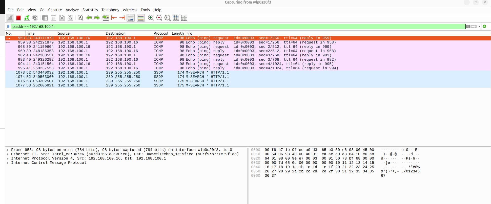
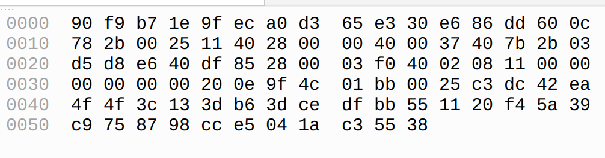
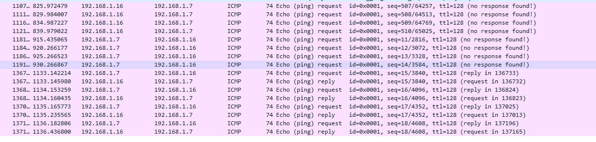
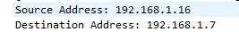
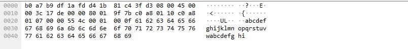
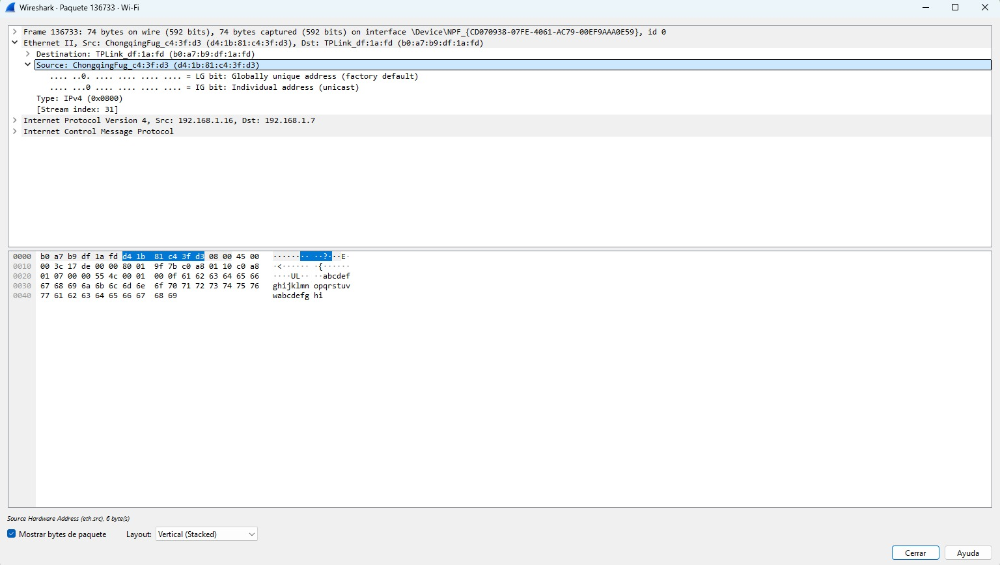
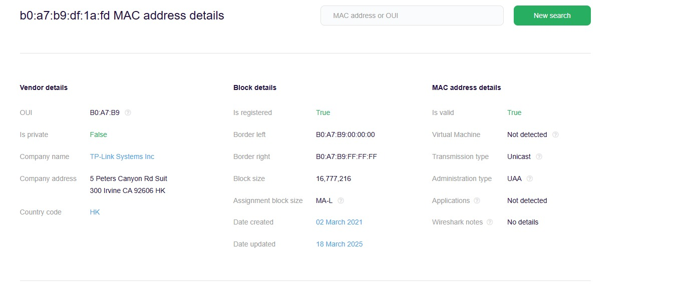

## TRABAJO PRÁCTICO N° 2 ~ Más conceptos fundamentales de capa física y capa de enlace de datos.

## Introducción 
En este trabajo práctico buscamos explorar conceptos esenciales de las capas Física y de Enlace de Datos, a través del análisis de fenómenos físicos que afectan la transmisión de datos y mediante el uso de herramientas como Wireshark. En este sentido, procuramos comprender cómo se estructuran, transmiten y analizan los datos de una red, reforzando tanto el conocimiento técnico como la mirada crítica sobre su trazabilidad y seguridad.
## Desarrollo

### Consigna 1: 
**a ~ Fenómeno físico representado y sus características principales:**

En la siguiente imagen podemos observar como un satélite establece una comunicación con una barco, este tipo de comunicación se denomina enlace satelital y se encarga de transmitir información a través de ondas electromagnéticas. Este fenómeno físico tiene como característica la propagación de ondas electromagnéticas en el espacio, y asociado ello hay otros fenómenos como:

- Atenuación por espacio libre (Free space path loss, FSPL): Es cuando, la potencia recibida disminuye con el cuadrado de la distancia y con la frecuencia.
  
- Dispersión y absorción atmosférica: Esto sucede cuando el vapor de agua, el oxígeno y distintas partículas absorben energía de la onda electromagnética transmitida.
  
- Desvanecimiento (Fading): Son fluctuaciones rápidas en la potencia, amplitud o fase causado por la multitrayectoria o condiciones atmosféricas, es decir ,esto sucede debido a que la señal llega por varios camino (reflexión,refracción,difracción) y las distintas señales generadas interfieren entre sí. También puede ser por la interferencia de nubes, lluvias las cuales pueden atenuar o distorsionar la señal.
  
- Retardo de propagación: Esto es debido a la gran distancia entre el receptor y el emisor(aprox 36.000 km de distancia).

**b ~ Tipos de transmisión más afectados y más resilientes:**

Las transmisiones más afectadas por el desvanecimiento y la atenuación atmosférica son aquellas que operan en frecuencias elevadas, especialmente en banda Ku (aprox. 12~18 GHz) y banda Ka (aprox. 26,5 ~ 40 GHz). En estas bandas, la lluvia, la humedad y las variaciones rápidas de fase o amplitud pueden degradar significativamente la calidad de la señal, provocando pérdidas de varios decibelios y requiriendo márgenes de enlace mayores o técnicas de mitigación como diversidad de frecuencia o modulación adaptativa.

Por el contrario, las transmisiones en frecuencias más bajas, como la banda L (1~2 GHz) y la banda C (4~8 GHz), resultan más resistentes a estos fenómenos, ya que presentan menor atenuación por lluvia y menor sensibilidad a la multitrayectoria. Sin embargo, aunque estas últimas soportan mejor las condiciones adversas, no están exentas del retardo de propagación inherente a la gran distancia de los satélites geoestacionarios, que impacta por igual a todas las bandas.

**c ~ Por qué no se debe encender el celular en un avión y su relación con el fenómeno:**

El uso de teléfonos móviles a bordo de una aeronave puede generar diversos problemas técnicos y de seguridad. En primer lugar, existe el riesgo de interferencia electromagnética, ya que los celulares transmiten en bandas UHF, aproximadamente entre 800 MHz y 2,6 GHz. Estas señales pueden acoplarse a los sistemas de navegación y comunicación del avión, que operan en frecuencias cercanas o en armónicas de estas, afectando potencialmente su correcto funcionamiento.

En segundo lugar, se presenta un problema de gestión de la red celular: a gran altitud, un teléfono puede detectar simultáneamente múltiples estaciones base en tierra, lo que provoca intentos de conexión y traspasos (handover) constantes, generando sobrecarga en la red terrestre y dificultando su operación. Por último, la normativa aeronáutica —establecida por organismos como la FAA, EASA o ANAC— prohíbe el uso de transmisores activos no autorizados durante el vuelo para minimizar cualquier riesgo de interferencia con sistemas críticos.

En cuanto a su relación con el fenómeno anterior, aunque no se trata exactamente del mismo caso que la atenuación por espacio libre o el rain fade, sí está vinculado con la capa física y la propagación de ondas electromagnéticas. En ambos contextos, el objetivo es controlar y gestionar la propagación de señales para evitar degradación o interferencia en sistemas esenciales para la operación segura.

### Consigna 2
**a ~ Fenómeno físico representado y sus características principales:**

El fenómeno físico representado en la figura es la interferencia electromagnética. La onda senoidal enviada por la antena emisora se ve perturbada por una fuente externa de interferencia, lo que provoca que llegue distorsionada al receptor (teléfono).

Las características principales son:

- **Aleatoriedad:** el ruido se comporta de manera impredecible en el tiempo.
- **Distorsión de la señal:** altera la amplitud, frecuencia o fase de la onda original.
- **Tipos de ruido frecuentes:**
    - Ruido térmico
    - Interferencia electromagnética
    - Ruido atmosférico
    - Ruido impulsivo
- **Consecuencias en las comunicaciones:**
    - Disminuye la relación señal/ruido (SNR).
    - Puede provocar errores en la transmisión de datos.
    - Reduce la calidad de la comunicación, ya sea en voz, video o datos.

**b ~ Tipos de transmisión más afectados y más resilientes:**

Este fenómeno afecta en distintas medidas según el tipo de transmisión:

- Las transmisiones analógicas (ej. AM, FM, TV analógica), ya que cualquier alteración se traduce directamente en pérdida de calidad.
- Las **bandas bajas y medias** (onda larga, onda corta, AM), más sensibles a ruidos atmosféricos y eléctricos.
- Los **medios metálicos** como el par trenzado sin apantallar (UTP), que son vulnerables a interferencias externas.

Y las más resilientes a este fenómeno son:

- Las **transmisiones digitales**, porque incluyen técnicas de detección y corrección de errores.
- Las **bandas altas** (microondas, ondas milimétricas), menos sensibles al ruido eléctrico.
- La **fibra óptica**, prácticamente inmune a interferencia electromagnética.
- Tecnologías modernas con **modulación robusta** (OFDM en Wi-Fi o LTE), que resisten mejor las perturbaciones.

**c ~ ¿Qué es la SNR? ¿Tiene algo que ver con el concepto de BER?**

La SNR es la relación señal-ruido, que compara la potencia de la señal útil con la potencia del ruido que la acompaña.  Una **SNR alta**indica mejor calidad de transmisión. 

La BER (Bit Error Rate) es la proporción de bits erróneos respecto al total transmitido. La relación entre ambos que una mayor SNR reduce la BER, y viceversa; esto ocurre ya que el reuido interfiere con la correcta detección de los bits.

### Consigna 3

#### a) Ethernet
Ethernet es la tecnología tradicional para conectar dispositivos en una red de área local (LAN) mediante cableado físico, permitiendo la comunicación entre ellos a través de un conjunto de reglas estandarizadas conocido como protocolo **IEEE 802.3**.  
Este protocolo define cómo los dispositivos de la red deben formatear, transmitir y recibir datos, de modo que puedan reconocer e interpretar la información de manera correcta.

Ethernet utiliza **tramas de datos** que incluyen direcciones físicas (**MAC**) de origen y destino, y establece un método de acceso al medio compartido.  
Los cables que constituyen el soporte físico por el cual viajan las tramas son principalmente de **par trenzado (UTP)** o **fibra óptica**.

##### Características principales:
- **Tecnología de capa de enlace (OSI capa 2):** funciona en el nivel de acceso de la red.  
- **Direccionamiento MAC:** identificadores únicos de 48 bits asignados a las interfaces de red de los dispositivos. Cada dispositivo posee uno de forma física.  
- **Medio físico:** generalmente cable UTP, aunque también puede usar fibra óptica.  
- **Método de acceso:** usa CSMA/CD (*Carrier Sense Multiple Access with Collision Detection*).

##### Estructura de una trama Ethernet:
Una **trama Ethernet** es la unidad de información que circula por la red y se compone de varios campos:

- **Dirección destino MAC (6 bytes):** identifica a qué dispositivo va el paquete.  
- **Dirección origen MAC (6 bytes):** dirección física del emisor del paquete.  
- **Longitud (2 bytes):** indica el protocolo de capa superior (como IPv4, IPv6, etc.).  
- **Datos (46-1500 bytes):** carga útil, puede ser un paquete IP, entre otros.  
- **CRC (4 bytes):** código de verificación para detectar errores en la trama.

##### Diferencias entre Ethernet, Fast Ethernet y Gigabit Ethernet:
La principal diferencia entre estas tecnologías radica en la **velocidad de transmisión** y en la **categoría de cable necesario**:

- **Ethernet:** velocidad de 10 Mbps, utiliza cableado UTP categoría 3 o superior.  
- **Fast Ethernet:** velocidad de 100 Mbps, requiere cable UTP categoría 5 o superior.  
- **Gigabit Ethernet:** velocidad de 1000 Mbps, funciona con cables de categoría más alta (Cat 5e, Cat 6, etc.).

Estas tecnologías están presentes en la mayoría de redes domésticas y empresariales.

---

#### b) Cable UTP
**UTP (Unshielded Twisted Pair)** es un tipo de cable de cobre compuesto por pares de hilos trenzados que **minimiza la interferencia electromagnética** y la **diafonía**, asegurando una conexión estable y confiable.  
Transmite señales utilizando 4 pares de hilos de cobre, donde cada par maneja un aspecto diferente de la señal.

La construcción de este cable está directamente relacionada con los fenómenos físicos vistos en la **consigna 2**:

- El **trenzado helicoidal** de cada par hace que la interferencia externa afecte a ambos conductores de forma similar.  
- Al combinar las señales, gran parte del ruido se cancela, reduciendo la **interferencia electromagnética (EMI)**.  
- También disminuye la **diafonía**, que es la interferencia entre los pares de hilos dentro del mismo cable.  
- Esto permite mantener la **independencia de cada canal de transmisión**, garantizando mejor calidad de señal.

En cuanto a la **SNR (Signal-to-Noise Ratio)**:
- A menor interferencia, mayor es la SNR.  
- Una SNR más alta implica una **menor tasa de error de bits (BER)**.  
- Por lo tanto, el uso de UTP ayuda a obtener **comunicaciones más confiables**.

> **Nota:**  
> El cable UTP no cuenta con blindaje metálico, lo que lo hace más vulnerable en entornos con alta interferencia eléctrica.

##### Tipos de cableado:
- **Cable derecho:** utilizado para conectar dispositivos diferentes (por ejemplo, una PC con un switch).  
- **Cable cruzado:** antes se utilizaba para conectar dispositivos iguales (por ejemplo, dos PCs), aunque hoy en día muchos equipos detectan automáticamente la conexión.

---

#### c) Análisis en Wireshark

**i) Puerta de enlace predeterminada:**

Se identificó la puerta de enlace predeterminada utilizando el siguiente comando en la terminal:

default via 192.168.100.1 dev wlp0s20f3 proto dhcp src 192.168.100.16 metric 600

Esto indica:
- La **dirección IP del router** es `192.168.100.1`.
- La **IP de nuestra computadora** es `192.168.100.16`.

---

**ii) Filtrar paquetes de esa dirección IP:**

En la barra de filtros de Wireshark (barra verde en la parte superior) ip.addr == 192.168.100.1

**iii) Ejecución de un ping a la puerta de enlace y monitorear Wireshark**
      1. Consultas DNS (azules)
      2.Paquetes ICMP (ping) en color rosa, enviados desde la PC 192.168.100.16 hacia el router 192.168.100.1 y viceversa
      
 **iv) Extracción y documentación los datos de un paquete en formato hexadecimal**

---
#### d) Dirección MAC del dispositivo 

--- 
#### e ) Repetir los ejercicios c) y d), pero comunicándote con otra computadora 

 

Listado de paquetes ICM capturados en Wireshark, observamos el intercambio de mensajes entre las dos dircciones IP. Distinguimos los Echo Request enviados y los Echo reply son los recibidos. 

Documentación del contenido de un paquete en hexadecimal

En esta imagen observamos la dirección MAC de destino b0:a7:b9:df:1a:fd. y la de origen, la cual pertenece a la PC que inicio el ping b0:a7:b9:df:1a:fd 

Dirección MAC de la computadora de destino b0:a7:b9:df:1a:fd 

### Consigna 4
# Seguridad de un dispositivo en la red y trazabilidad de una dirección MAC

## 1. Seguridad de un dispositivo en la red

La seguridad de un dispositivo de la red implica proteger distintos tipos de acceso al dispositivo:

- **Acceso físico**: Restringir quién puede conectar cables o tocar el equipo (switch, router).
- **Acceso lógico**: Uso de contraseñas seguras en consola, VTY (acceso remoto), y modo privilegiado con contraseña. Uso de encriptación (**SSH en lugar de Telnet**).
- **Seguridad a nivel de switch (capa 2)**: Limitar las direcciones MAC que pueden conectarse a un puerto físico, prevenir ataques de **MAC flooding**, donde un atacante llena la tabla MAC del switch.
- **Firewall**: Implementación de firewalls para aislar el tráfico hacia el host y hacia la red.

---

## 2. Trazabilidad de la dirección MAC

La trazabilidad de la dirección MAC se produce de distintas formas:

- **En un switch**: se mantiene una **tabla CAM (Content Addressable Memory)** donde se asocian direcciones MAC con puertos físicos.
- **En un router**: mediante la **tabla ARP**, se asocian direcciones IP con direcciones MAC.
- **En toda la red**: siguiendo los saltos de switch en switch, se puede rastrear dónde está conectada físicamente una MAC. 

---

## 3. IMEI vs Dirección MAC

- **IMEI (International Mobile Equipment Identity)**:  
  Número único de **15 dígitos** que identifica a cada dispositivo de telefonía móvil. Está grabado en el hardware por el fabricante y se utiliza en redes móviles (LTE, 5G).  
  Sus principales funciones:
  - Identificar el equipo en la red.
  - Bloquearlo en caso de pérdida o robo (**lista negra de IMEIs**).
  - Autorizar o denegar su acceso.

- **Relación con la dirección MAC**:  
  Ambos son **identificadores únicos de hardware**, pero en **redes diferentes**:
  - **IMEI** → identifica el *dispositivo móvil* en la red de la operadora celular.  
  - **MAC** → identifica la *tarjeta de red* en redes locales (WiFi, Ethernet, Bluetooth).  

Ambos son claves para **seguridad y trazabilidad**.

---

## 4. VPN y dirección MAC

**¿Una VPN oculta la dirección MAC del dispositivo?**

- La respuesta es **sí, pero con matices**:  
  - La **dirección MAC** solo se usa en la **red local (LAN o WLAN)**, es decir, entre el dispositivo final y el primer salto (switch o router WiFi).  
  - Cuando el tráfico sale a Internet, lo que ven los servidores es la **dirección IP pública**, no la MAC.  
  - La dirección MAC **no viaja más allá del router**, ya que en cada salto es reemplazada por la del siguiente equipo de capa 2.  

- Una **VPN** oculta la **dirección IP real hacia Internet**.  
  - **Dentro de la LAN**: el router o switch sigue viendo la MAC real, ya que sin ella no es posible comunicarse en la red local.  
  - **Fuera de la LAN (Internet)**: la MAC nunca viaja, uses VPN o no.  

 **Conclusión**:  
Una VPN no “oculta” la dirección MAC, ya que esta nunca sale de la red local.  
Lo único que protege realmente una VPN es la **IP pública** y el **contenido del tráfico**.
